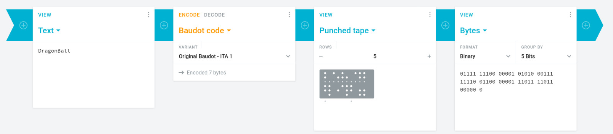
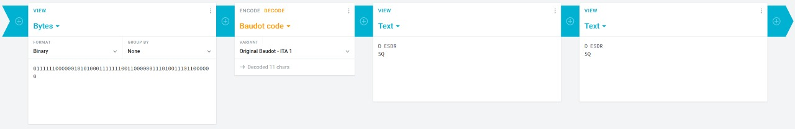
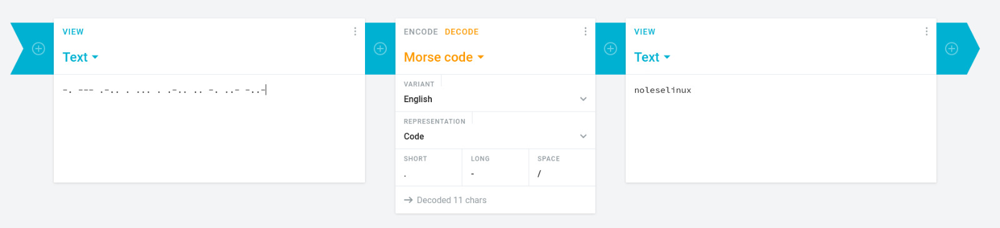

<!-- ---
header-includes:
  - \usepackage{amsmath}
  - \usepackage{amssymb}
  - \usepackage{fontspec}
  - \setmainfont{FiraCode Nerd Font}
  - \setmonofont{FiraCode Nerd Font Mono}
  - \usepackage{setspace}
  - \setstretch{1.5}
  - \usepackage{fvextra}
  - \DefineVerbatimEnvironment{Highlighting}{Verbatim}{breaklines,commandchars=\\\{\}}
  - \hypersetup{colorlinks=true, linkcolor=blue, urlcolor=blue}
geometry: top=0.67in, bottom=0.67in, left=0.85in, right=0.85in
--- -->

# Reporte Grupal - Morse y Baudot

**Grupo:**

- Flavio Galán - 22386
- Josue Say - 22801

**Pareja colaboradora:**

- Daniel Rayo
- Irving Acosta  

## Parte 1 – Comunicación con Código

### 1.1 Esquemas de codificación

- **¿Qué esquema (código) fue más fácil y difícil de transmitir y por qué?**

  El  esquema  más  fácil  fue  el  de  **morse**,  principalmente  porque  no  todos  los  caracteres requerían enviar 5 sonidos, así que fue más rápido el identificar las letras y patrones, vs el de **Baudot** que siempre quería los 5 sonidos y si se escuchaba uno mal la letra cambiaba.

- **¿Qué esquema tuvo menos errores?**  
  El código Morse tuvo menos errores. Se logró decodificar una frase exacta, mientras que en los otros dos esquemas solo se logró una aproximación al mensaje. En el caso de Baudot, no se logró recuperar una frase válida.

**Baudot comparación de mensajes:**





**Morse comparación de mensajes:**




### 1.2 Mensajes empaquetados

- **¿Qué dificultades involucra el enviar un mensaje de forma “empaquetada”?**  
  Más que dificultades diría que se tenía mejoras, ya que si un audio está malo simplemente se  puede  cancelar  el  envío,  cosa  que  no  podíamos  hacer  con  el  anterior  ya  que  la comunicación era en vivo. La única “dificultad” que se nos ocurrió es que ahora teníamos que  fijarnos  que  el  destinatario  sea  correcto en el mensaje y no solo hablar como en la llamada.

### 1.3 Conmutadores

- **¿Qué posibilidades incluye la introducción de un conmutador en el sistema?**  
  Permite  manejar  recursos  si  se  comparte  la  misma  línea,  ya  que  permite  parar  la  comunicación entre mensajes a menos que él autorice. Un contra que tiene es que añade la  necesidad de un protocolo para organizar los mensajes y el destinatario de estos.

- **¿Qué ventajas/desventajas se tienen al momento de agregar más conmutadores al sistema?**  
  **Ventajas:**
  - Se puede dividir el procesamiento de mensajes.
  - La  capacidad  para  traducir  por  partes el mensaje y reducir la carga de trabajo al enrutar el mensaje -> decodificarlo y puede incluir una capa de seguridad para que la  información  no  esté  centralizada  y  si  se  detecta  en  un  punto  la  información  no  tendría valor para el que la obtiene porque tendría que encontrar las demas partes  que se distribuyen a los conmutadores.

  **Desventajas:**
  - Aumenta el overhead, ya que se debe indicar también a qué conmutador va dirigido.
  - Añade complejidad a la estructura del mensaje y al protocolo de comunicación.

## Protocolo utilizado para el conmutador

- Cada cliente debía solicitar permiso al conmutador con el mensaje `'a'`.
- Si el conmutador estaba disponible, respondía también con `'a'`.
- La estructura del mensaje era:  

```bash
<destinatario>tt<mensaje>
```

Se usó `"tt"` como delimitador porque no aparece en palabras en español, evitando confusiones.

**Problemas encontrados:**

- El destinatario no conoce el origen del mensaje.
- No se tiene confirmación de recepción por parte del destinatario.

Este protocolo fue simple pero efectivo para controlar la comunicación a través del conmutador sin sobrecargarlo.

## Errores cometidos

- **En la fase de transmisión:** Se cometieron errores en la codificación Baudot, principalmente por pérdida de sincronización.
- **En el protocolo:** No se incluyó un mecanismo de acuse de recibo ni identificación del remitente, lo cual dificultó validar la entrega de los mensajes.

## Conclusiones

Este laboratorio permitió experimentar de forma práctica cómo diferentes esquemas de codificación y arquitecturas de red (conmutador) afectan la confiabilidad y eficiencia de una comunicación. Se aprendió que, aunque los sistemas simples como Morse pueden ser efectivos, requieren estructuras de control adicionales (como protocolos) al operar en sistemas más complejos como conmutadores.

También se identificó la importancia de tener protocolos bien definidos para evitar pérdida de información, ambigüedad o sobrecarga de los elementos centrales de la red.
