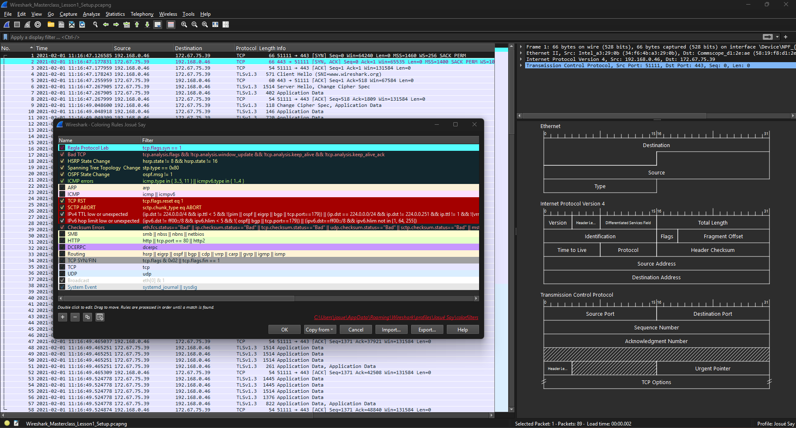
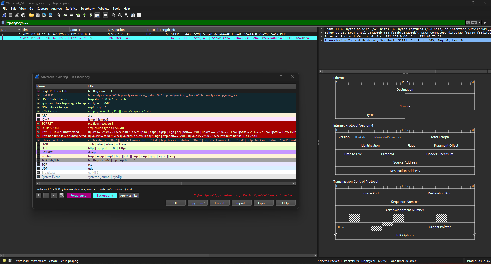
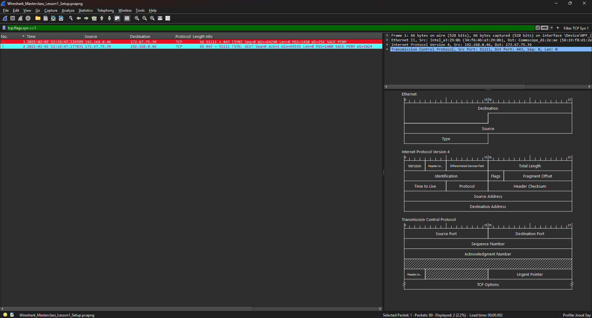
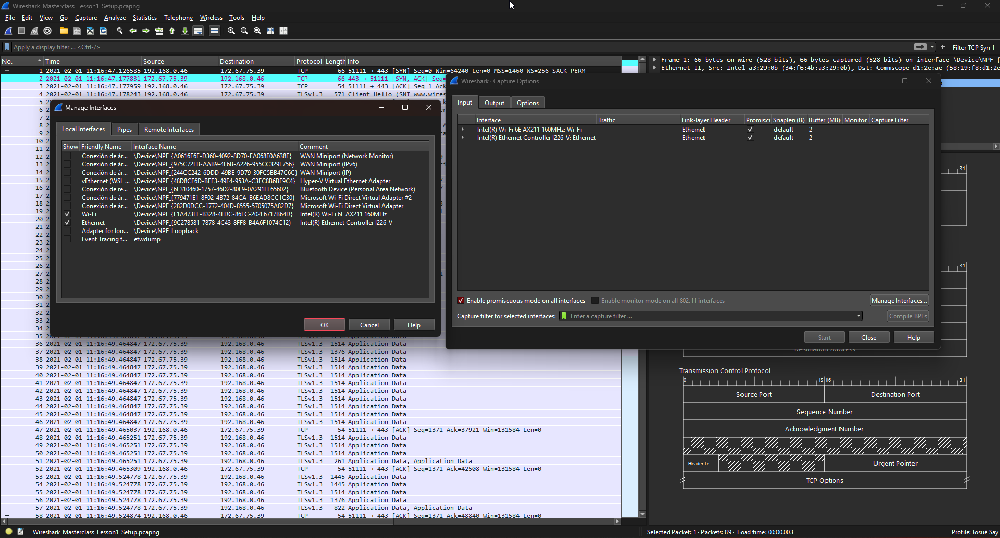
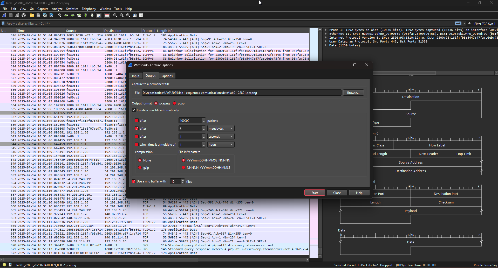
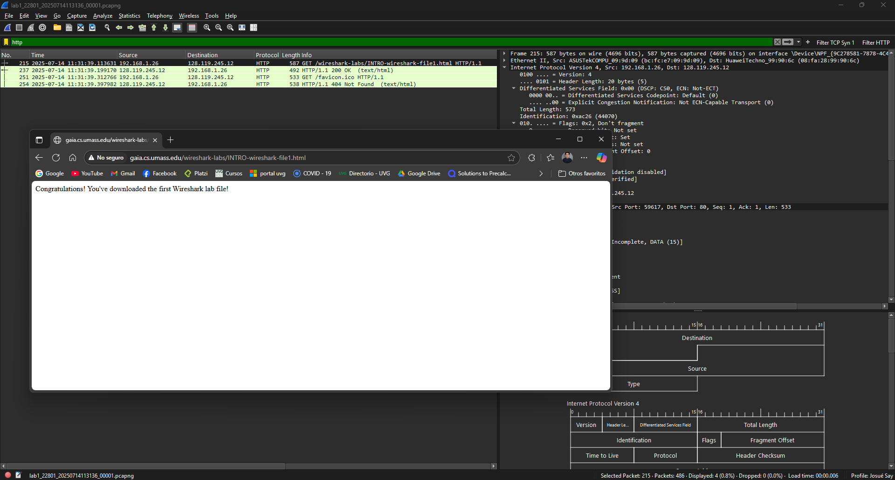

<!-- ---
header-includes:
  - \usepackage{amsmath}
  - \usepackage{amssymb}
  - \usepackage{fontspec}
  - \setmainfont{FiraCode Nerd Font}
  - \setmonofont{FiraCode Nerd Font Mono}
  - \usepackage{setspace}
  - \setstretch{1.5}
  - \usepackage{fvextra}
  - \DefineVerbatimEnvironment{Highlighting}{Verbatim}{breaklines,commandchars=\\\{\}}
  - \hypersetup{colorlinks=true, linkcolor=blue, urlcolor=blue}
geometry: top=0.67in, bottom=0.67in, left=0.85in, right=0.85in
--- -->

# Reporte Individual - Introducción a Wireshark

Esta parte fue individual y consistió en configurar el entorno de Wireshark, capturar paquetes de red, y realizar un análisis detallado del protocolo HTTP.

## Identificación

- Josué Say - 22801

## 1.1 Personalización del entorno

En esta primera fase, se realizó la personalización del entorno de Wireshark para adaptarlo a nuestras preferencias de uso. A continuación, se detallan las acciones realizadas:

- Se creó un nuevo perfil.
- Se descargó y abrió el archivo de captura desde [Cloudshark](https://www.cloudshark.org/captures/e6fb36096dbb).
- Se aplicó el formato de tiempo **Time of Day**.
- Se añadió una nueva columna denominada `Length Protocol`.


Además:

- Se aplicó un **esquema de paneles personalizado** (diferente del valor por defecto).
- Se creó una **regla de color** para resaltar los paquetes TCP con la bandera SYN activa (`SYN = 1`), asignando un color distintivo para facilitar su identificación.
- Se añadió un **botón de filtro** que permite activar rápidamente el filtro correspondiente a paquetes TCP con `SYN = 1`.







## 1.2 Configuración de la captura de paquetes

En esta sección, se configura la captura de paquetes utilizando un **ring buffer**, lo cual permite dividir la captura en múltiples archivos con un tamaño y número máximos establecidos. Se realizaron los siguientes pasos:

1. Se ejecutó el comando `ifconfig` (Linux/macOS) o `ipconfig` (Windows) para identificar las interfaces de red disponibles.

    - **Respuesta:** Se puede observar al final del pdf la documentación relacionada a los comandos.

2. En Wireshark, se desactivaron las interfaces virtuales o no utilizadas para evitar ruido innecesario en la captura.

    

3. Se configuró una **captura con ring buffer** utilizando las siguientes opciones:

   - Tamaño por archivo: **5 MB**
   - Número máximo de archivos: **10**
   - Nombre del archivo base: `lab1_22801.pcapng`

   La configuración se realizó desde la interfaz gráfica de Wireshark (o, alternativamente, mediante línea de comandos), generando tráfico para activar la creación de los archivos.

    

> Además, se consultó la [documentación oficial de Wireshark](https://www.wireshark.org/docs/man-pages/tshark.html), donde se describe cómo ejecutar una captura equivalente a la realizada por la interfaz gráfica mediante el comando `tshark`.
> La sintaxis general del comando es:
>
> ```bash
> tshark -i <número_de_interfaz> -b filesize:<tamaño_en_kilobytes> -b files:<cantidad_de_archivos> -w "<ruta_completa>\<nombre_archivo>"
> ```
>
> Para identificar el número de interfaz correcto, se utilizó el comando:
>
> ```bash
> tshark -D
> ```
>
> En este caso, la interfaz **Ethernet** corresponde al número `9`, por lo que el comando final utilizado fue:
>
> ```bash
> tshark -i 9 -b filesize:5120 -b files:10 -w "C:\Users\josue\Downloads\lab1_20281.pcapng"
> ```

## 1.3 Análisis de paquetes

Para esta sección, se realizó una captura de tráfico HTTP con el fin de responder preguntas relacionadas con el protocolo y analizar el contenido devuelto por el servidor.

1. Se inició una captura sin filtro en Wireshark.
2. Desde el navegador, se accedió a la dirección:
   [http://gaia.cs.umass.edu/wireshark-labs/INTRO-wireshark-file1.html](http://gaia.cs.umass.edu/wireshark-labs/INTRO-wireshark-file1.html)
3. Una vez cargada la página, se detuvo la captura.

  

### Preguntas

- **¿Qué versión de HTTP está ejecutando su navegador?**

  - **Respuesta:** Dada la línea del *Frame 215:* `Request Version: HTTP/1.1`, utiliza un HTTP 1.1.

- **¿Qué versión de HTTP está ejecutando el servidor?**

  - **Respuesta:** Dada la línea del *Frame 237:* `Response Version: HTTP/1.1`, utiliza un HTTP 1.1.

- **¿Qué lenguajes acepta el navegador según la cabecera `Accept-Language`?**
  
  - **Respuesta:** Dada la línea del *Frame 215* `Accept-Language: es-419,es;q=0.9,es-ES;q=0.8,en;q=0.7,en-GB;q=0.6,en-US;q=0.5\r\n` acepta:

      | Código     | Lenguaje                  |
      |------------|---------------------------|
      | es-419     | Español latinoamericano   |
      | es         | Español                   |
      | es-ES      | Español de España         |
      | en         | Inglés general            |
      | en-GB      | Inglés británico          |
      | en-US      | Inglés americano          |

- **¿Cuántos bytes de contenido fueron devueltos por el servidor?**

  - **Respuesta:** Dada la línea del *Frame 237* `Content-Length: 81` y `File Data: 81 bytes`, el servidor devolvió 81 bytes.

- **En caso de problemas de rendimiento durante la descarga, ¿en qué elementos de la red convendría escuchar los paquetes? ¿Es conveniente instalar Wireshark en el servidor? Justifique.**

  - **Respuesta:** Conviene capturar paquetes tanto del lado del cliente como del servidor para identificar dónde ocurre el retraso. En el caso del servidor, que usualmente está montado sobre un sistema operativo Linux (Ubuntu) por ende es preferible utilizar herramientas como tcpdump, que permiten capturar paquetes directamente desde la terminal. Alternativamente, si se requiere una salida compatible con Wireshark, puede usarse tshark, la versión de línea de comandos de Wireshark.

## Discusión

Durante el desarrollo del laboratorio se exploraron distintas funcionalidades de Wireshark, desde la personalización del entorno hasta la configuración avanzada de captura con ring buffer. Una dificultad clave fue entender cómo Wireshark gestiona los archivos rotativos: aunque se configura un límite de archivos, los nombres siguen aumentando, lo que puede generar confusión. Además, se identificó que Wireshark no detiene la captura automáticamente bajo estas condiciones, por lo que es responsabilidad del usuario controlarlo manualmente. El análisis HTTP permitió ver claramente cómo interactúan cliente y servidor, y cómo se puede extraer información clave de los encabezados, como versión del protocolo, idiomas aceptados o tamaño del contenido.

## Comentario

La experiencia permitió familiarizarse con herramientas reales de monitoreo de red, aplicando configuraciones prácticas como el uso de tshark para automatizar capturas. Se comprobó que el ring buffer es ideal para capturas prolongadas, ya que permite conservar solo los archivos más recientes y controlar el uso de almacenamiento. Además, el análisis de tráfico HTTP mostró cómo Wireshark puede revelar detalles útiles de las comunicaciones web. Por último, se comprendió que, para diagnósticos de rendimiento, capturar en múltiples puntos de la red (cliente, servidor, gateway) proporciona un panorama más completo del problema.

## Documentación de comandos de red (PowerShell y WSL)

### 1. Salida del comando `ipconfig` en PowerShell (Windows)

Este comando proporciona información sobre la configuración de red de los adaptadores de red disponibles en el sistema Windows. A continuación se describe cada sección importante del resultado obtenido:

#### Adaptador de Ethernet `Ethernet`

- **Dirección IPv6**:
  `2800:98:161f:fb5:1d4c:edb2:e797:353a`
  Dirección IPv6 global asignada por el proveedor de Internet.

- **Dirección IPv6 temporal**:
  `2800:98:161f:fb5:5447:47fa:c0eb:73f6`
  Dirección generada temporalmente para preservar la privacidad del usuario.

- **Vínculo: dirección IPv6 local**:
  `fe80::7f18:8f07:ed7b:c7de%14`
  Dirección local para comunicaciones dentro de la red local.

- **Dirección IPv4**:
  `192.168.1.26`
  Dirección asignada por el router en una red privada.

- **Máscara de subred**:
  `255.255.255.0`
  Define el tamaño de la red local (permite hasta 254 hosts).

- **Puerta de enlace predeterminada**:
  `192.168.1.1`
  Dirección del router o gateway que conecta la red local con otras redes (como Internet). También aparece una dirección IPv6: `fe80::1%14`.

#### Otros adaptadores

Los siguientes adaptadores muestran el estado "medios desconectados", lo que indica que no están en uso en ese momento:

- LAN inalámbrica Wi-Fi
- Conexiones de área local virtuales
- Conexión de red Bluetooth

#### Adaptador de red virtual `vEthernet (WSL (Hyper-V firewall))`

Este adaptador es utilizado por WSL para establecer conectividad de red con el entorno Linux virtualizado.

- **Dirección IPv4**:
  `172.20.112.1`
  Dirección IPv4 usada internamente para la red entre Windows y WSL.

- **Máscara de subred**:
  `255.255.240.0`

- **Vínculo: dirección IPv6 local**:
  `fe80::9491:c657:154b:e161%23`

### 2. Salida del comando `ifconfig` en WSL (Ubuntu)

El comando `ifconfig` proporciona detalles sobre los dispositivos de red activos dentro del entorno Linux. A continuación se describen los adaptadores relevantes.

#### Interfaz `eth0` (adaptador de red principal)

- **Dirección IPv4 (`inet`)**:
  `172.20.126.187`
  Dirección asignada a la máquina virtual de WSL desde el adaptador virtual de Windows.

- **Máscara de subred**:
  `255.255.240.0`

- **Dirección de broadcast**:
  `172.20.127.255`
  Dirección utilizada para enviar datos a todos los dispositivos de la subred.

- **Dirección IPv6 (`inet6`)**:
  `fe80::215:5dff:fe31:722`
  Dirección local de enlace para uso dentro de la red local.

- **Dirección MAC (`ether`)**:
  `00:15:5d:31:07:22`
  Identificador físico de la tarjeta de red (dirección Ethernet).

- **Estadísticas de tráfico**:

  - Paquetes recibidos (RX): 122 paquetes, 214368 bytes
  - Paquetes transmitidos (TX): 108 paquetes, 7456 bytes
  - Sin errores, colisiones ni pérdidas reportadas

#### Interfaz `lo` (loopback o interfaz local)

- **Dirección IPv4 (`inet`)**:
  `127.0.0.1`
  Dirección usada para comunicaciones internas dentro del sistema operativo (localhost).

- **Dirección IPv6 (`inet6`)**:
  `::1`
  Equivalente IPv6 de localhost.

- **Estadísticas de tráfico**:

  - RX y TX: 14 paquetes, 1710 bytes en ambas direcciones
  - Sin errores ni pérdidas

### Referencias

- [Demystifying ifconfig and network interfaces in Linux](https://codewithyury.com/demystifying-ifconfig-and-network-interfaces-in-linux/)
- [Significado de campos en eth0](https://superuser.com/questions/1153104/when-i-type-in-ifconfig-to-the-command-line-what-does-the-information-mean)
- [RX errors and Frame in ifconfig output](https://serverfault.com/questions/185331/exact-meaning-of-rx-errors-and-frame-in-ifconfig-output)
