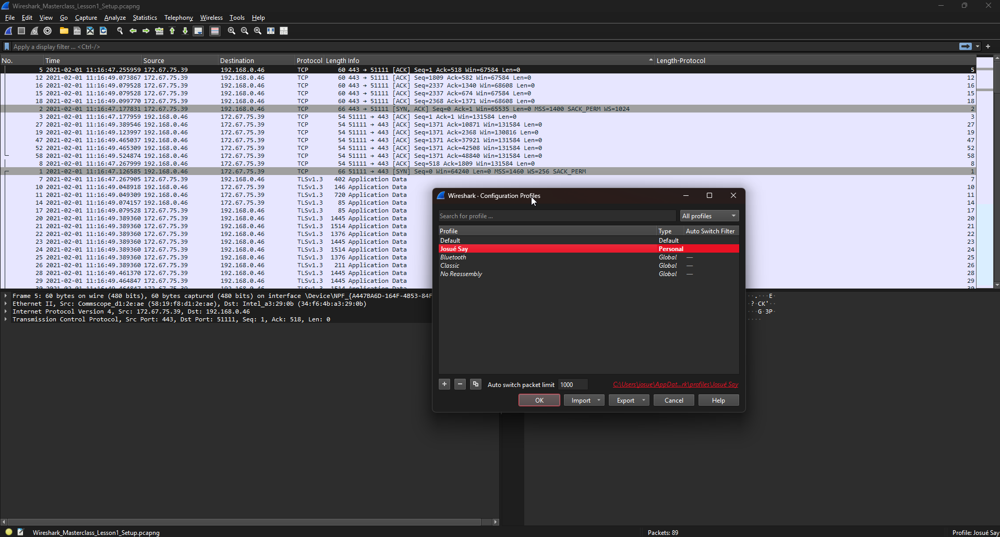

# Introducción a Wireshark

## 1.1 Personalización del entorno

En esta primera fase, se realizó la personalización del entorno de Wireshark para adaptarlo a nuestras preferencias de uso. A continuación, se detallan las acciones realizadas:

* Se creó un nuevo perfil con el nombre del estudiante.
* Se descargó y abrió el archivo de captura desde [Cloudshark](https://www.cloudshark.org/captures/e6fb36096dbb).
* Se aplicó el formato de tiempo **Time of Day** para visualizar la hora completa de cada paquete capturado.
* Se añadió una nueva columna denominada `Length Protocol`.



Además:

* Se aplicó un **esquema de paneles personalizado** para modificar la disposición de los paneles (diferente del valor por defecto).
* Se creó una **regla de color** para resaltar los paquetes TCP con la bandera SYN activa (`SYN = 1`), asignando un color distintivo para facilitar su identificación.
* Se añadió un **botón de filtro** que permite activar rápidamente el filtro correspondiente a paquetes TCP con `SYN = 1`.

Esto permitió un entorno visual más organizado y funcional para el análisis de tráfico.


## 1.2 Configuración de la captura de paquetes

En esta sección, se configura la captura de paquetes utilizando un **ring buffer**, lo cual permite dividir la captura en múltiples archivos con un tamaño y número máximos establecidos. Se realizaron los siguientes pasos:

1. Se ejecutó el comando `ifconfig` (Linux/macOS) o `ipconfig` (Windows) para identificar las interfaces de red disponibles.

    | Entorno              | Comando usado | Interfaz detectada | Dirección IP     | Máscara de subred | Relación/Ruta                                                                  |
    | -------------------- | ------------- | ------------------ | ---------------- | ----------------- | ------------------------------------------------------------------------------ |
    | PowerShell (Windows) | `ipconfig`    | `Ethernet`         | `192.168.1.26`   | `255.255.255.0`   | IP física de la máquina anfitriona conectada al router local                   |
    | PowerShell (Windows) | `ipconfig`    | `vEthernet (WSL)`  | `172.20.112.1`   | `255.255.240.0`   | Adaptador virtual creado por Hyper-V para conectar WSL a Windows               |
    | WSL (Ubuntu)         | `ifconfig`    | `eth0`             | `172.20.126.187` | `255.255.240.0`   | Dirección asignada dentro de WSL; se comunica con Windows mediante `vEthernet` |
    | WSL (Ubuntu)         | `ifconfig`    | `lo` (loopback)    | `127.0.0.1`      | `255.0.0.0`       | Interfaz local para procesos internos del entorno Linux                        |

2. En Wireshark, se desactivaron las interfaces virtuales o no utilizadas para evitar ruido innecesario en la captura.

    

3. Se configuró una **captura con ring buffer** utilizando las siguientes opciones:

   * Tamaño por archivo: **5 MB**
   * Número máximo de archivos: **10**
   * Nombre del archivo base: `lab1_22801.pcapng`

   La configuración se realizó desde la interfaz gráfica de Wireshark (o, alternativamente, mediante línea de comandos), generando tráfico para activar la creación de los archivos.

    

> Además, se consultó la [documentación oficial de Wireshark](https://www.wireshark.org/docs/man-pages/tshark.html), donde se describe cómo ejecutar una captura equivalente a la realizada por la interfaz gráfica mediante el comando `tshark`.
> La sintaxis general del comando es:
>
> ```bash
> tshark -i <número_de_interfaz> -b filesize:<tamaño_en_kilobytes> -b files:<cantidad_de_archivos> -w "<ruta_completa>\<nombre_archivo>"
> ```
>
> Para identificar el número de interfaz correcto, se utilizó el comando:
>
> ```bash
> tshark -D
> ```
>
> En este caso, la interfaz **Ethernet** corresponde al número `9`, por lo que el comando final utilizado fue:
>
> ```bash
> tshark -i 9 -b filesize:5120 -b files:10 -w "C:\Users\josue\Downloads\lab1_20281.pcapng"
> ```

## 1.3 Análisis de paquetes

Para esta sección, se realizó una captura de tráfico HTTP con el fin de responder preguntas relacionadas con el protocolo y analizar el contenido devuelto por el servidor.

1. Se inició una captura sin filtro en Wireshark.
2. Desde el navegador, se accedió a la dirección:
   [http://gaia.cs.umass.edu/wireshark-labs/INTRO-wireshark-file1.html](http://gaia.cs.umass.edu/wireshark-labs/INTRO-wireshark-file1.html)
3. Una vez cargada la página, se detuvo la captura.

A partir de la traza obtenida, se respondieron las siguientes preguntas:

a. **¿Qué versión de HTTP está ejecutando su navegador?**
b. **¿Qué versión de HTTP está ejecutando el servidor?**
c. **¿Qué lenguajes acepta el navegador según la cabecera `Accept-Language`?**
d. **¿Cuántos bytes de contenido fueron devueltos por el servidor?**
e. **En caso de problemas de rendimiento durante la descarga, ¿en qué elementos de la red convendría escuchar los paquetes? ¿Es conveniente instalar Wireshark en el servidor? Justifique.**

*Capturas de pantalla que validan las respuestas aquí.*

## Discusión

<!-- * Reflexión sobre la experiencia con la personalización del entorno y la captura con ring buffer.
* Dificultades encontradas y cómo se resolvieron.
* Herramientas útiles descubiertas durante el análisis. -->

## Conclusiones

<!-- * Wireshark permite una personalización profunda que mejora significativamente el análisis de tráfico.
* El uso de filtros, reglas de color y perfiles personalizados optimiza el entorno de trabajo.
* La configuración de ring buffer es clave para capturas prolongadas y segmentadas.
* El análisis del protocolo HTTP permite entender el flujo de datos entre cliente y servidor de forma detallada. -->

## Documentación de comandos de red (PowerShell y WSL)

### 1. Salida del comando `ipconfig` en PowerShell (Windows)

Este comando proporciona información sobre la configuración de red de los adaptadores de red disponibles en el sistema Windows. A continuación se describe cada sección importante del resultado obtenido:

#### Adaptador de Ethernet `Ethernet`

* **Dirección IPv6**:
  `2800:98:161f:fb5:1d4c:edb2:e797:353a`
  Dirección IPv6 global asignada por el proveedor de Internet.

* **Dirección IPv6 temporal**:
  `2800:98:161f:fb5:5447:47fa:c0eb:73f6`
  Dirección generada temporalmente para preservar la privacidad del usuario.

* **Vínculo: dirección IPv6 local**:
  `fe80::7f18:8f07:ed7b:c7de%14`
  Dirección local para comunicaciones dentro de la red local.

* **Dirección IPv4**:
  `192.168.1.26`
  Dirección asignada por el router en una red privada.

* **Máscara de subred**:
  `255.255.255.0`
  Define el tamaño de la red local (permite hasta 254 hosts).

* **Puerta de enlace predeterminada**:
  `192.168.1.1`
  Dirección del router o gateway que conecta la red local con otras redes (como Internet). También aparece una dirección IPv6: `fe80::1%14`.

#### Otros adaptadores

Los siguientes adaptadores muestran el estado "medios desconectados", lo que indica que no están en uso en ese momento:

* LAN inalámbrica Wi-Fi
* Conexiones de área local virtuales
* Conexión de red Bluetooth

#### Adaptador de red virtual `vEthernet (WSL (Hyper-V firewall))`

Este adaptador es utilizado por WSL para establecer conectividad de red con el entorno Linux virtualizado.

* **Dirección IPv4**:
  `172.20.112.1`
  Dirección IPv4 usada internamente para la red entre Windows y WSL.

* **Máscara de subred**:
  `255.255.240.0`

* **Vínculo: dirección IPv6 local**:
  `fe80::9491:c657:154b:e161%23`

### 2. Salida del comando `ifconfig` en WSL (Ubuntu)

El comando `ifconfig` proporciona detalles sobre los dispositivos de red activos dentro del entorno Linux. A continuación se describen los adaptadores relevantes.

#### Interfaz `eth0` (adaptador de red principal)

* **Dirección IPv4 (`inet`)**:
  `172.20.126.187`
  Dirección asignada a la máquina virtual de WSL desde el adaptador virtual de Windows.

* **Máscara de subred**:
  `255.255.240.0`

* **Dirección de broadcast**:
  `172.20.127.255`
  Dirección utilizada para enviar datos a todos los dispositivos de la subred.

* **Dirección IPv6 (`inet6`)**:
  `fe80::215:5dff:fe31:722`
  Dirección local de enlace para uso dentro de la red local.

* **Dirección MAC (`ether`)**:
  `00:15:5d:31:07:22`
  Identificador físico de la tarjeta de red (dirección Ethernet).

* **Estadísticas de tráfico**:

  * Paquetes recibidos (RX): 122 paquetes, 214368 bytes
  * Paquetes transmitidos (TX): 108 paquetes, 7456 bytes
  * Sin errores, colisiones ni pérdidas reportadas

#### Interfaz `lo` (loopback o interfaz local)

* **Dirección IPv4 (`inet`)**:
  `127.0.0.1`
  Dirección usada para comunicaciones internas dentro del sistema operativo (localhost).

* **Dirección IPv6 (`inet6`)**:
  `::1`
  Equivalente IPv6 de localhost.

* **Estadísticas de tráfico**:

  * RX y TX: 14 paquetes, 1710 bytes en ambas direcciones
  * Sin errores ni pérdidas

### Referencias

* [Demystifying ifconfig and network interfaces in Linux](https://codewithyury.com/demystifying-ifconfig-and-network-interfaces-in-linux/)
* [Significado de campos en eth0](https://superuser.com/questions/1153104/when-i-type-in-ifconfig-to-the-command-line-what-does-the-information-mean)
* [RX errors and Frame in ifconfig output](https://serverfault.com/questions/185331/exact-meaning-of-rx-errors-and-frame-in-ifconfig-output)
